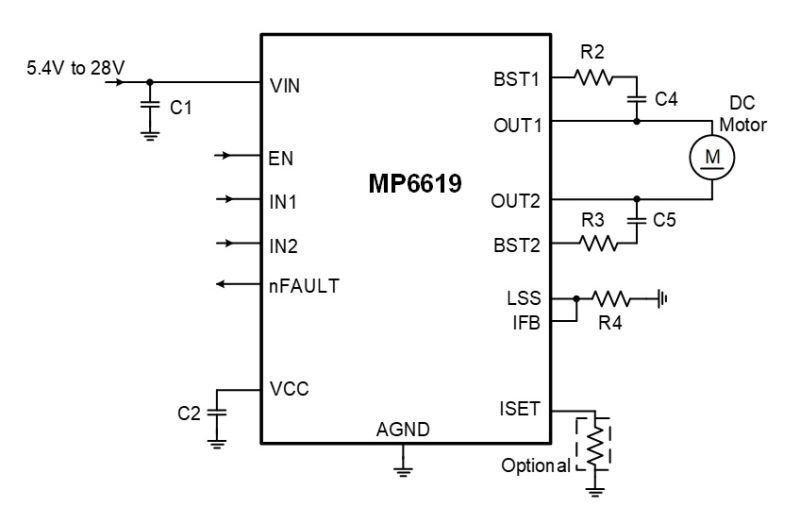
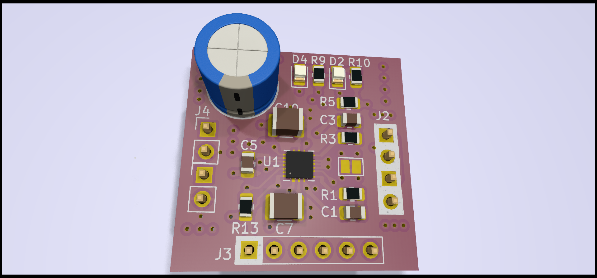

# ELEKTOR_MP6619 Breakout Board Project

This repository contains the KiCAD project files for the Elektor Magazine article about the MP6619 H-bridge chip Breakout Board.





## Software Requirement

This project was designed using the latest nightly version of KiCAD. 

### Installation on Ubuntu:

To install the nightly build of KiCAD on Ubuntu, you can use the following commands:

```bash
sudo add-apt-repository ppa:kicad/kicad-dev-nightly
sudo apt update
sudo apt install kicad-nightly
```
### Installation on Windows:
The KiCAD files have also been tested on Windows. To download the nightly builds for Windows, please visit this link. https://downloads.kicad.org/kicad/windows/explore/nightlies

### Project History
The project evolved over time:

* **First Attempt (Dual Chip Breakout Board)**: The initial design of the project was a dual chip breakout board, found in the directory 2HBR_NG.

* **Second Attempt (Single Chip Breakout Board)**: The design was later revised to create a single chip breakout board, found in the directory 2HBR_NG/2HBR_MINIMAL.

To open the project, use the following command in terminal:

```console
user@werkpc:~$ kicad-nightly 2HBR_NG/2HBR_MINIMAL/2HBR_MINIMAL.kicad_pro
```
### Output Files
The 'out1' directory contains the Gerber files used to manufacture the PCB board.

### Support
If you encounter any issues or require further assistance, feel free to create an issue in this repository.

### License
MIT license, no warranties.
The MIT license is a permissive license that is short and easy to understand. It permits users to use, copy, modify, merge, publish, distribute, sublicense, and sell the software and associated documentation files. Here's the general summary:

  * Use: You can use the hardware in any setting, for any purpose, and without needing to pay for it.

  * Copy: You can make as many copies of the hardware as you want, and give them away or sell them.
  * Modify: You can make changes to the hardware, and use the modified hardware. You can also distribute modified copies, or sell hardware based on the modified designs.
  * Merge: You can combine the hardware with other hardware to make something new, and distribute or sell that.
  * Publish: You can share copies of the hardware, or make them publicly available (for example, by posting them online).
  * Distribute: You can give copies of the hardware to other people.
  * Sublicense: You can allow other people to do any of the above with the hardware.
  * Sell: You can sell copies of the hardware.

The above permissions are granted for free, and apply to both the original version of the hardware and to any modified versions that you make.

The license also includes a "disclaimer of warranty" stating that the hardware is provided "as is" without warranty of any kind.

However, please note that any derivative work you create must maintain the original licensing, i.e., the licensing information must always be included in the hardware documentation, design files, etc.
